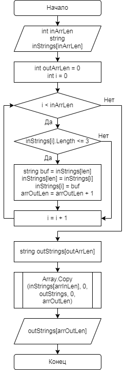

# Итоговая проверочная работа

## [Репозиторий](https://github.com/Vit73125/ChooseSpecialisation.git) на GitHub

## Задача

Написать программу, которая из имеющегося массива строк формирует массив из строк, длина которых меньшелибо равна 3 символа. Первоначальный массивможно ввести склавиатуры, либо задать на старте выполнения алгоритма. Задача решается только через массив, использование коллекций исключается.

## Блок-схема алгоритма

